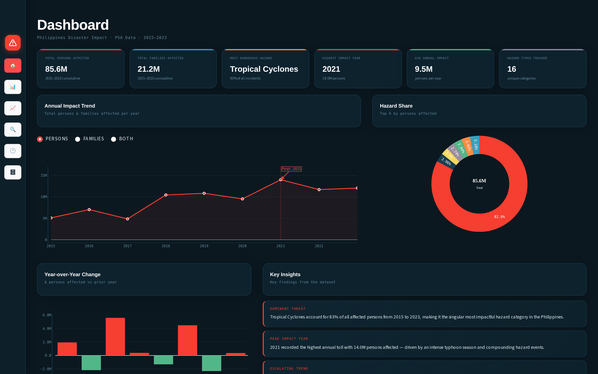

<h1 align="center">🌪️ DisasterVision</h1>

<p align="center">
  AI-powered disaster hazard classification paired with an interactive analytics dashboard for Philippine disaster impact data.
</p>

<p align="center">
  
  
  
  
</p>

<p align="center">
  
</p>

<br>

## 📑 Table of Contents

- [✨ Features](#-features)
- [📊 Model Performance](#-model-performance)
- [🛠️ Tech Stack](#️-tech-stack)
- [📂 Project Structure](#-project-structure)
- [🚀 Getting Started](#-getting-started)
- [🗄️ Dataset](#️-dataset)
- [🤝 Contributing](#-contributing)
- [🐛 Issues](#-issues)
- [📄 License](#-license)

---

## ✨ Features

### 📈 Analytics Dashboard

- **Executive Dashboard** — KPI cards and trends at a glance (total persons/families affected, most dangerous hazard, peak impact year)
- **Disaster Analytics** — breakdowns by hazard category (Meteorological, Hydrological, Geophysical, Climatological, Biological, Combined Events)
- **Visualizations** — interactive Plotly charts covering top hazards and year-over-year trends
- **Dataset Explorer** — browse and filter the underlying cleaned dataset directly in-app

### 🔍 AI Classifier

- **Image Upload & Predict** — upload a photo and get a live hazard classification (earthquake, fire, flood, landslide, or normal) with per-class confidence scores
- **Prediction History** — every prediction is logged to SQLite and viewable/filterable in-app

---

## 📊 Model Performance

EfficientNetB0 trained via transfer learning on a five-class hazard dataset.

| Metric | Score |
|---|---|
| Test Accuracy | 96.40% |
| Test Loss | 0.106 |
| Macro F1-score | 0.954 |

| Class | Precision | Recall | F1-score |
|---|---|---|---|
| Earthquake | 0.93 | 0.96 | 0.94 |
| Fire | 0.98 | 0.99 | 0.99 |
| Flood | 0.98 | 0.97 | 0.97 |
| Landslide | 0.92 | 0.90 | 0.91 |
| Normal | 0.96 | 0.95 | 0.95 |

Confusion matrix and training curves are available in `eval/`.

---

## 🛠️ Tech Stack

| Layer | Technology |
|---|---|
| Model | TensorFlow / Keras (EfficientNetB0, transfer learning) |
| Dashboard | Streamlit + Plotly |
| Data handling | Pandas, NumPy, SQLite (prediction history) |
| Data prep | Jupyter notebooks (`data_cleaning.ipynb`, `train.ipynb`) |
| Key packages | `tensorflow`, `streamlit`, `plotly`, `pandas`, `numpy`, `pillow`, `scikit-learn` |

---

## 📂 Project Structure

```
├── app.py                          # Streamlit dashboard entry point
├── train.ipynb                     # Model training notebook
├── data_cleaning.ipynb             # Data cleaning / preprocessing notebook
│
├── models/
│   └── disaster_classifier.keras   # Trained EfficientNetB0 model
│
├── eval/
│   ├── metrics.json                # Test accuracy, precision/recall/F1
│   ├── confusion_matrix.png
│   └── training_curves.png
│
├── outputs/
│   ├── cleaned_tidy.csv            # Cleaned dataset (tidy format)
│   ├── cleaned_wide.csv            # Cleaned dataset (wide format)
│   ├── summary_by_hazard.csv       # Aggregated stats per hazard type
│   └── *.html                      # Pre-rendered Plotly chart exports
│
├── number_of_affected_people.xlsx  # Raw source dataset
├── predictions.db                  # SQLite DB of classifier predictions
├── image/
│   └── dashboard_screenshot.png    # Dashboard preview image
└── requirements.txt
```

---

## 🚀 Getting Started

### Prerequisites

- Python 3.9+
- `pip`

### 1. Clone the repo

```bash
git clone https://github.com/<your-username>/disastervision.git
cd disastervision
```

### 2. Install dependencies

```bash
pip install -r requirements.txt
```

### 3. Run the dashboard

```bash
streamlit run app.py
```

The app opens at `http://localhost:8501`.

> **Note:** The AI Classifier page requires TensorFlow and the trained model at `models/disaster_classifier.keras`. Every other page (Executive Dashboard, Analytics, Visualizations, Prediction History, Dataset Explorer) works without TensorFlow installed.

### 4. (Optional) Retrain the model

Open `train.ipynb` in Jupyter or VS Code to retrain or fine-tune the classifier. `data_cleaning.ipynb` covers the preprocessing pipeline for the source dataset in `number_of_affected_people.xlsx`.

---

## 🗄️ Dataset

The dashboard is powered by historical Philippine disaster impact data — persons and families affected per hazard type, by year — sourced from PSA records and cleaned into tidy/wide CSV formats for analysis (`outputs/cleaned_tidy.csv`, `outputs/cleaned_wide.csv`). The image classifier is trained on a separate labeled image set covering five classes: earthquake, fire, flood, landslide, and normal.

---

## 🤝 Contributing

This started as a solo student capstone project, but improvements are always welcome. Here's how to contribute:

1. **Fork** the repository.
2. **Create a feature branch**
   ```bash
   git checkout -b feature/your-feature-name
   ```
3. **Make your changes.** Dashboard pages live in `app.py` (one function per page); model training logic lives in `train.ipynb`; data prep lives in `data_cleaning.ipynb`.
4. **Commit your changes**
   ```bash
   git commit -m "Add: short description of your change"
   ```
5. **Push to your branch**
   ```bash
   git push origin feature/your-feature-name
   ```
6. **Open a pull request** describing what you changed and why.

Since this project doesn't have an automated test suite yet, please manually verify your change against the relevant dashboard page(s) or notebook before opening a PR, and mention what you tested in the PR description.

---

## 🐛 Issues

Found a bug, or something not working as expected? Check the [Issues](https://github.com/<your-username>/disastervision/issues) page first to see if it's already been reported.

If not, feel free to open a new issue. To help track it down quickly, please include:

- A clear, descriptive title (e.g. "Classifier page crashes on PNG upload")
- Steps to reproduce the issue
- What you expected to happen vs. what actually happened
- Relevant logs/traceback from `streamlit run app.py`
- Screenshots, if it's a dashboard/UI issue
- Whether it happens on the Dashboard side, the Classifier side, or both

